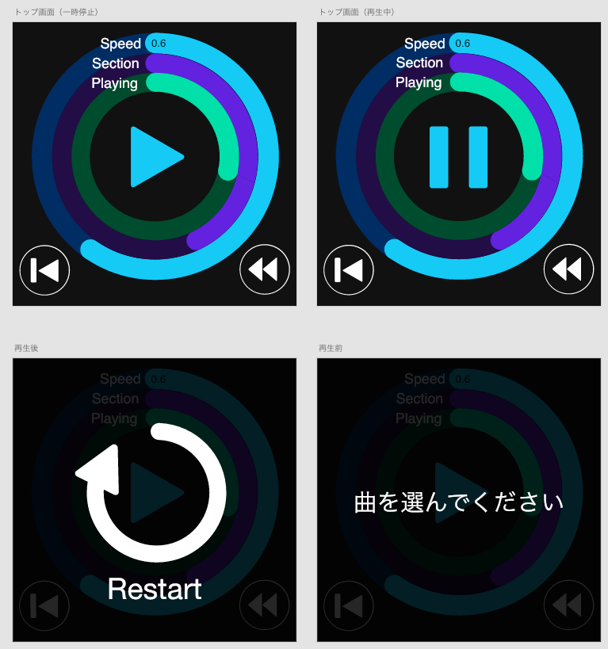

# Aktiva Turbo 仕様

## 画面デザイン
### 画面一覧

### 画面遷移
[XDプロトタイプ](https://xd.adobe.com/view/664d4abd-c7e9-43b7-b0b4-84bdfc139bcd/screen/2f98c6f2-36db-4745-b7d4-d8b979d999ad/-)

## 機能一覧
### 表示系統
* 現在の再生 / 一時停止状態表示
* 再生速度（Speed）表示
* 練習区間（Section）表示
* 再生位置（Playing）表示

### 操作系統
* 再生、一時停止
* 頭出し（左下ボタン）
  * 一気に曲の頭まで戻る
* 早戻し（右下ボタン）
  * 押している間だけ戻る
* もう一度再生（Restart）
  * 曲終了後、もう一度頭から再生する